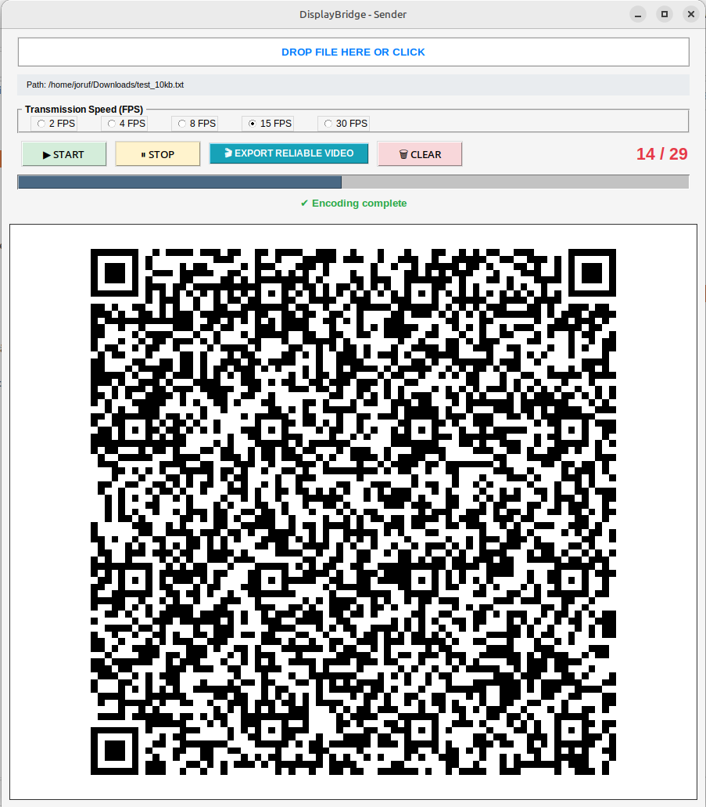
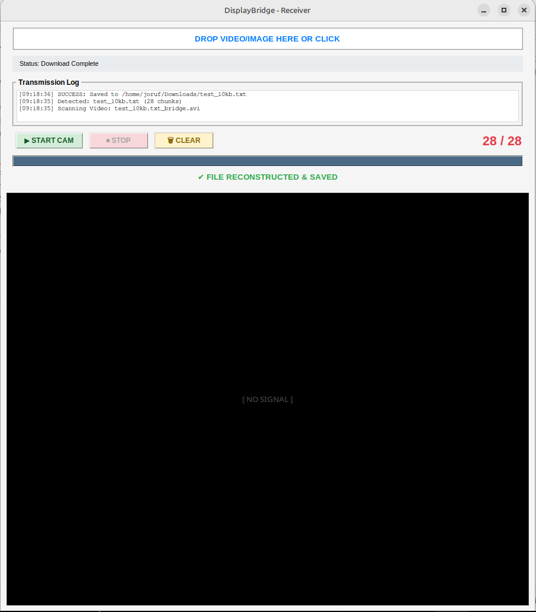

# DisplayBridge 🛰️

**DisplayBridge** is a high-reliability visual data transfer suite that allows you to "beam" files between devices using dynamic QR code sequences. It is the perfect solution for bridging air-gapped systems or transferring data when traditional networking (Wi-Fi, USB, Bluetooth) is restricted.

---

## Features

- **Visual Air-Gap Jump** – Transfer data using only a screen and a camera.
- **Dual-Mode Acquisition** – Supports live webcam scanning and video/image file import.
- **Lossless Reliability** – Uses MJPG 100% quality encoding and frame redundancy (duplicated Start/End frames).
- **Smart Filtering** – Automatically validates media types (ignores non-image/video files).
- **Real-Time Feedback** – Integrated UI log, progress bars, and visual QR detection markers.
- **Drag & Drop** – Easy file handling with `TkinterDnD` integration.
- **Auto-Dependency Management** – Checks and installs required Python libraries on startup.

---

## Technical Protocol

DisplayBridge uses a structured packet system to ensure data arrives correctly even if frames are captured out of order.


### Packet Structure
- **START Packet:** `START|filename|total_chunks|sha256_hash`
  - Initializes the transfer and sets the security anchor for verification.
- **DATA Packet:** `DATA|chunk_index|base64_payload`
  - Carries the actual file content with sequence tracking for reconstruction.

### Security & Integrity
Before transmission, the **Sender** generates a SHA-256 fingerprint. The **Receiver** re-calculates this hash after reassembly. If the hashes do not match (due to corruption or manipulation), the file is discarded to prevent saving "junk" data.

---

## Overview

### Sender Interface
The **Sender** encodes your files into a high-speed QR stream. Use the FPS presets to match your camera's capability.


### Receiver Interface
The **Receiver** captures the stream via webcam or file import. The real-time log tracks every decoded chunk.


---

---

## Platform Support

### Linux
Optimized for Debian-based distributions (Python 3.12+):
- **Linux Mint** (Cinnamon, MATE, XFCE)
- **Ubuntu** & official flavors
- **Debian, Pop!_OS, Zorin OS**

### Windows
- Windows 10 or 11
- Python 3.10+ installed

---

## Requirements

The scripts will attempt to auto-install these via `pip` if they are missing:
- `opencv-python` (cv2)
- `pyzbar` (ZBar decoding)
- `qrcode[pil]` (QR generation)
- `pillow` (Image processing)
- `numpy`
- `tkinterdnd2-universal` (Drag & Drop support)

**Linux Note:** You may need to install the ZBar system library manually:
```bash
sudo apt update && sudo apt install libzbar0
